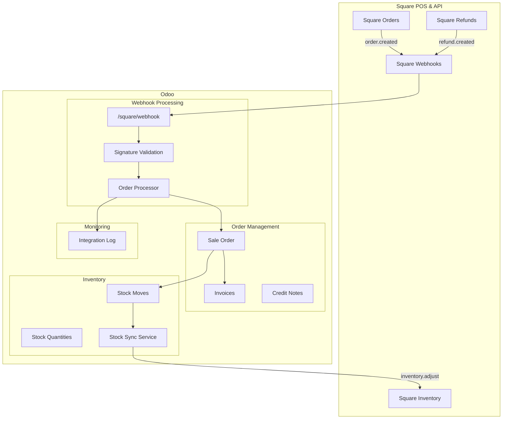

# Odoo Square Integration

A complete Odoo module for integrating with Square POS, featuring webhook processing, bidirectional inventory sync, and advanced order management including refunds and exchanges.

## Features

### 1. Webhook Processing (Square → Odoo)
- **Secure Endpoint**: `/square/webhook` with HMAC-SHA256 signature validation
- **Supported Events**: 
  - `order.created` - New orders
  - `order.updated` - Exchanges and modifications
  - `refund.created` / `refund.updated` - Refunds
- **Smart Customer Matching**: Email → Phone → Name → Auto-create
- **Complete Flow**: Sales Order → Invoices/Credit Notes → Stock Moves → Inventory Updates

### 2. Advanced Returns and Exchanges
- **Full Refunds**: Order cancellation + Automatic credit note + Stock return
- **Equivalent Exchanges**: Quantity changes + New line + Simultaneous stock moves
- **Price-Difference Exchanges**: Additional invoice or credit note based on price difference
- **History Preservation**: Zero quantities (no deletion) for complete traceability

### 3. Bidirectional Inventory Sync (Odoo ↔ Square)
- **Real-Time Updates**: Triggered on stock moves and manual adjustments
- **Shop Warehouse Focus**: Sync only from configured warehouse
- **Loop Prevention**: Exclude Square-originated moves to avoid conflicts
- **Square Inventory API**: Catalog search and proper inventory adjustments

### 4. Monitoring and Traceability
- **Centralized Integration Log**: Complete history of all operations
- **Chatter Messages**: Automatic trace on each Odoo order
- **Unified Interface**: Configuration, Actions, and Activities in a single view
- **Alerts and Errors**: Detailed tracking of integration issues

## Requirements

- Odoo 17.0 (Community or Enterprise)
- Python packages: `requests`
- Square Developer Account with API credentials

## Quick Start with Docker

### 1. Clone the Repository

```bash
git clone https://github.com/davaico/odoo-square.git
cd odoo-square
```

### 2. Configure Environment

```bash
cp .env.example .env
# Edit .env with your settings
```

### 3. Start the Services

```bash
docker compose up -d
```

### 4. Access Odoo

Open http://localhost:8069 in your browser.

Default credentials (change in production):
- Database: `odoo`
- Email: `admin`
- Password: Set during first setup

### 5. Install the Module

1. Go to **Apps** menu
2. Click **Update Apps List**
3. Search for "Odoo Square Integration"
4. Click **Install**

### 6. Configure Square Integration

1. Go to **Settings** → **Square Configuration**
2. Enter your Square API credentials:
   - Application ID
   - Access Token
   - Location ID
   - Webhook Signature Key
3. Configure the shop warehouse for inventory sync
4. Test the connection

## Development Setup

### Prerequisites

- Docker and Docker Compose
- Git

### Local Development

```bash
# Clone the repo
git clone https://github.com/davaico/odoo-square.git
cd odoo-square

# Copy environment file
cp .env.example .env

# Start services
docker compose up -d

# View logs
docker compose logs -f odoo

# Run tests
docker compose exec odoo odoo \
  -d odoo \
  --db_host=db \
  --test-enable \
  --stop-after-init \
  --test-tags="odoo_square"
```

### Project Structure

```
odoo-square/
├── addons/
│   └── odoo_square/           # Main module
│       ├── controllers/       # Webhook endpoints
│       ├── models/            # Business logic
│       ├── views/             # UI definitions
│       ├── data/              # Default data
│       ├── security/          # Access rights
│       └── tests/             # Unit tests
├── config/
│   └── odoo.conf              # Odoo configuration
├── docker-compose.yml         # Docker services
├── Dockerfile                 # Odoo image build
└── README.md
```

## Configuration

### Environment Variables

| Variable | Description | Default |
|----------|-------------|---------|
| `DB_NAME` | PostgreSQL database name | `odoo` |
| `DB_HOST` | PostgreSQL host | `db` |
| `DB_USER` | PostgreSQL user | `odoo` |
| `DB_PASSWORD` | PostgreSQL password | *(required)* |

### Square API Setup

1. Create a Square Developer account at https://developer.squareup.com
2. Create an application
3. Get your credentials from the Developer Dashboard:
   - **Application ID**: Found in app settings
   - **Access Token**: Generate in OAuth settings
   - **Location ID**: Found in Locations tab
4. Create a webhook subscription pointing to `https://your-odoo-url/square/webhook`
5. Copy the webhook signature key

## Testing

Run the test suite:

```bash
docker compose exec odoo odoo \
  -d odoo \
  --db_host=db \
  --test-enable \
  --stop-after-init \
  --test-tags="odoo_square" \
  --log-level=test
```

## Architecture



## Contributing

Contributions are welcome! Please:

1. Fork the repository
2. Create a feature branch
3. Make your changes
4. Run tests
5. Submit a pull request

## License

This project is licensed under the **GNU Affero General Public License v3.0** - see the [LICENSE](LICENSE) file for details.

## Support

- **Issues**: https://github.com/davaico/odoo-square/issues
- **Documentation** (To Complete): https://github.com/davaico/odoo-square/wiki

## Authors

- **Davai** - https://davai.co
