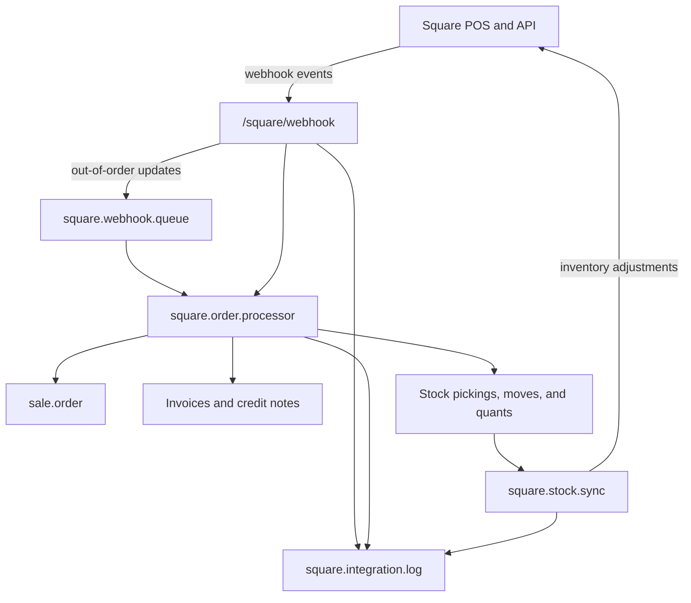

# Square POS Integration

[](https://github.com/davaico/odoo-square/actions/workflows/ci.yml)
[](LICENSE)
[](https://www.odoo.com)

Production-oriented Odoo 17 addon for integrating Square POS with Odoo Sales, Accounting, and Inventory.

The module processes Square webhooks, creates and updates Odoo sales orders, handles refunds and exchanges, maps Square locations to Odoo warehouses, and synchronizes inventory with an auditable activity log.

## Features

- Secure Square webhook endpoint at `/square/webhook` with HMAC-SHA256 validation when a webhook signature key is configured.
- Order ingestion for `order.created` and `order.updated` events, including customer matching and sale order creation.
- Refund and exchange handling with invoices, credit notes, stock returns, and preserved order history.
- Square location to Odoo warehouse mapping for multi-location inventory workflows.
- Inventory synchronization hooks for Odoo stock movements and manual quantity changes.
- Manual resync wizard for finding and replaying missing Square orders.
- Integration log models and views for monitoring webhook, order, refund, exchange, and stock sync activity.
- Docker Compose development and CI test setup.

## Requirements

- Odoo 17.0 Community or Enterprise
- PostgreSQL supported by Odoo 17.0
- Python package: `requests`
- Square Developer account with an application, access token, location IDs, and webhook signature key
- Docker and Docker Compose for the included local development environment

## Compatibility

This repository follows Odoo addon versioning. The current manifest version is `17.0.1.4.0`, where `17.0` is the Odoo series and `1.4.0` is the addon release version.

The addon manifest declares the following Odoo dependencies:

- `base`
- `web`
- `sale`
- `sales_team`
- `account`
- `stock`
- `payment`

## Quick Start

Clone the repository:

```bash
git clone https://github.com/davaico/odoo-square.git
cd odoo-square
```

Create a local environment file:

```bash
cp .env.example .env
```

Edit `.env` and set a non-default `DB_PASSWORD`.

Start Odoo and PostgreSQL:

```bash
docker compose up -d
```

Open [http://localhost:8069](http://localhost:8069), create or select a database, update the Apps list, then install **Square POS Integration**.

## Square Configuration

In Odoo, open **Settings > Square Configuration** and configure:

- Square Application ID
- Square Access Token
- Environment: `Sandbox` or `Production`
- Webhook Signature Key
- Payment Journal
- Square Location to Odoo Warehouse mappings
- Optional Sales Team mappings

In the Square Developer Dashboard, create a webhook subscription that points to:

```text
https://your-odoo-domain.example/square/webhook
```

Configure at least these event types:

- `order.created`
- `order.updated`
- `payment.updated`
- `refund.created`
- `refund.updated`

For production deployments, run Odoo behind HTTPS and keep `proxy_mode = True` in `config/odoo.conf` when a reverse proxy terminates TLS.

## Development

Start the local stack:

```bash
docker compose up -d
```

Follow Odoo logs:

```bash
docker compose logs -f odoo
```

Restart Odoo after Python changes:

```bash
docker compose restart odoo
```

Update the addon after manifest, XML, or model changes:

```bash
docker compose exec odoo bash -lc 'odoo \
  --config=/etc/odoo/odoo.conf \
  -d odoo \
  --db_host="${HOST:-db}" \
  --db_port=5432 \
  --db_user="${USER:-odoo}" \
  --db_password="$PASSWORD" \
  -u odoo_square \
  --stop-after-init'
```

## Testing

Run the same test command used by CI:

```bash
DB_PASSWORD=ci_odoo_test docker compose -f docker-compose.test.yml run --rm odoo \
  odoo \
    --config=/etc/odoo/odoo.conf \
    -d odoo \
    --db_host=db \
    --db_port=5432 \
    --db_user=odoo \
    --db_password=ci_odoo_test \
    -i odoo_square \
    --test-enable \
    --workers=0 \
    --stop-after-init \
    --test-tags=odoo_square \
    --log-level=test
```

The suite includes HTTP webhook tests, Square order/refund integration scenarios, stock return behavior, manual resync behavior, and addon contract tests.

## Project Structure

```text
odoo-square/
├── odoo_square/
│   ├── controllers/            # Public webhook endpoint
│   ├── data/                   # Default users and Square products
│   ├── models/                 # Odoo business models and services
│   ├── security/               # ir.model.access.csv
│   ├── static/description/     # Odoo app listing assets
│   ├── tests/                  # Odoo TransactionCase and HttpCase tests
│   └── views/                  # Backend UI views and menus
├── config/                     # Odoo container configuration
├── .github/workflows/          # CI
├── docker-compose.yml          # Local development stack
├── docker-compose.test.yml     # Test stack used by CI
└── README.md
```

## Architecture


```mermaid
flowchart TB
    Square["Square POS and API"]
    Webhook["/square/webhook"]
    Queue["square.webhook.queue"]
    Processor["square.order.processor"]
    Sale["sale.order"]
    Accounting["Invoices and credit notes"]
    Stock["Stock pickings, moves, and quants"]
    Sync["square.stock.sync"]
    Log["square.integration.log"]

    Square -->|"webhook events"| Webhook
    Webhook -->|"out-of-order updates"| Queue
    Queue --> Processor
    Webhook --> Processor
    Processor --> Sale
    Processor --> Accounting
    Processor --> Stock
    Stock --> Sync
    Sync -->|"inventory adjustments"| Square
    Webhook --> Log
    Processor --> Log
    Sync --> Log
```

## Operational Notes

- Configure the webhook signature key in Odoo before exposing the endpoint publicly.
- Keep Square access tokens out of Git. Use Odoo configuration records, environment-specific secrets management, or encrypted backups.
- Map every active Square location to the intended Odoo warehouse before enabling production inventory sync.
- Review **Square Integration Logs** after installation and after every Square credential or webhook change.
- Use the manual resync wizard for missed or delayed Square events instead of replaying raw webhook requests manually.

## Contributing

Contributions are welcome. Read [CONTRIBUTING.md](CONTRIBUTING.md) before opening an issue or pull request.

## Security

Please do not open public issues for vulnerabilities. See [SECURITY.md](SECURITY.md) for the supported version and private reporting process.

## License

This project is licensed under the GNU Affero General Public License v3.0 or later. See [LICENSE](LICENSE).
